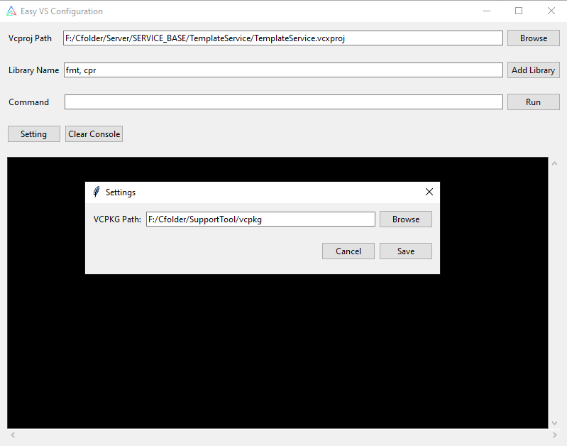

# Easy-VS-Configuration

Ứng dụng này giúp bạn dễ dàng cấu hình và quản lý các thư viện từ vcpkg trong Visual Studio 2022, hỗ trợ quá trình phát triển phần mềm C++ hiệu quả hơn.



## 1. Clone vcpkg từ GitHub
Mở **Command Prompt (cmd)** hoặc **PowerShell**, sau đó chạy:

```sh
git clone https://github.com/microsoft/vcpkg.git
cd vcpkg
bootstrap-vcpkg.bat

Lưu ý: Nếu bạn dùng Linux/macOS, hãy chạy:
./bootstrap-vcpkg.sh

Mở app và setting đường dẫn vào vcpkg folder là xong